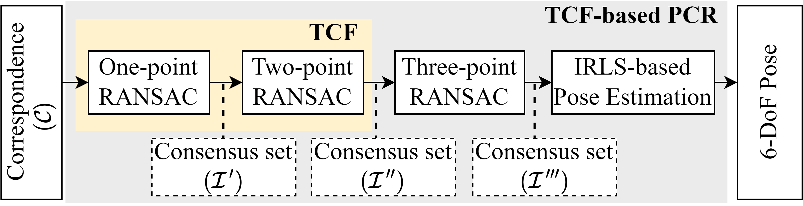

<h1 align="center">TCF (Two-stage Consensus Filtering)</h1>

<p style="text-align: justify;">
<strong>TCF</strong> is a 3D correspondence-based point cloud registration method. It elevates RANSAC to SOTA speed and accuracy. Firstly, one-point RANSAC obtains a consensus set based on length consistency. Subsequently, two-point RANSAC refines the set via angle consistency. Then, three-point RANSAC computes a coarse pose and removes outliers based on transformed correspondence’s distances. Drawing on optimizations from one-point and two-point RANSAC, three-point RANSAC requires only a few iterations. Eventually, an iterative reweighted least squares (IRLS) is applied to yield the optimal pose.
</p>

<p align="center">
  <br>
  <em>(a) Overall framework</em>
</p>
<p align="center">
  <br>
  <em>(b) Outlier Removal</em>
</p>

##  News
- **2025.01:** The preprocessed dataset in TCF is available: [Dataset Available](https://drive.google.com/drive/folders/1uKN2pqymFc85tY13Cw7kUNop7uQOEOSB).
- **2024.11:** TCF has been accepted for *IEEE Robotics and Automation Letters*: [Published Paper](https://ieeexplore.ieee.org/document/10758239).

##  Citation
If you use code of TCF in your academic research, please cite our paper:
```
@ARTICLE{10758239,
  author={Shi, Pengcheng and Yan, Shaocheng and Xiao, Yilin and Liu, Xinyi and Zhang, Yongjun and Li, Jiayuan},
  journal={IEEE Robotics and Automation Letters}, 
  title={RANSAC Back to SOTA: A Two-Stage Consensus Filtering for Real-Time 3D Registration}, 
  year={2024},
  volume={9},
  number={12},
  pages={11881-11888},
  doi={10.1109/LRA.2024.3502056}}
```

## Dependencies
- **CMake**
- **PCL** (Point Cloud Library)
- **Eigen ≥ 3.4** (for slicing matrix)
- **nlohmann_json** (for reading config files)

## File and data structure
### Configure files
```bash
config
│   ├── config_eth.json
│   └── config_kitti.json
```
### Data structure
```bash
data
├── ETH_TLS
│   └── facade
│       ├── s1_v0.1_sor.pcd
│       ├── s2_v0.1_sor.pcd
│       ├── s2_s1_top3.match
│       ├── s2-s1.pose
│       └── ...
├── KITTI
│   └── 09
│       ├── 210_v0.3.pcd
│       ├── 191_v0.3.pcd
│       ├── 210_191_top3.match
│       ├── 210-191.pose
│       └── ...
```
- **xx.json**: Contains paths for source point cloud, target point cloud, initial correspondences, and ground truth pose.
- **xx.pcd**: Source and target point cloud.
- **A_B_top3.match**: A correspondence file where A is source (left 3 columns) and B is target (right 3 columns).
- **xx.pose**: The 4*4 groundtruth pose from A to B

**Note:** Source and target point clouds are used to calculate resolution and estimate noise level, enabling **a genralized method without manual parameter adjustments**. If not available, values can be set manually, but correspondences remain necessary.

## How to use?
### Complie and run Demo
```bash
mkdir build && cd build
cmake ..
make -j8
./demo
```
### Run other data
To test with different data, simply update the data path in the config file.